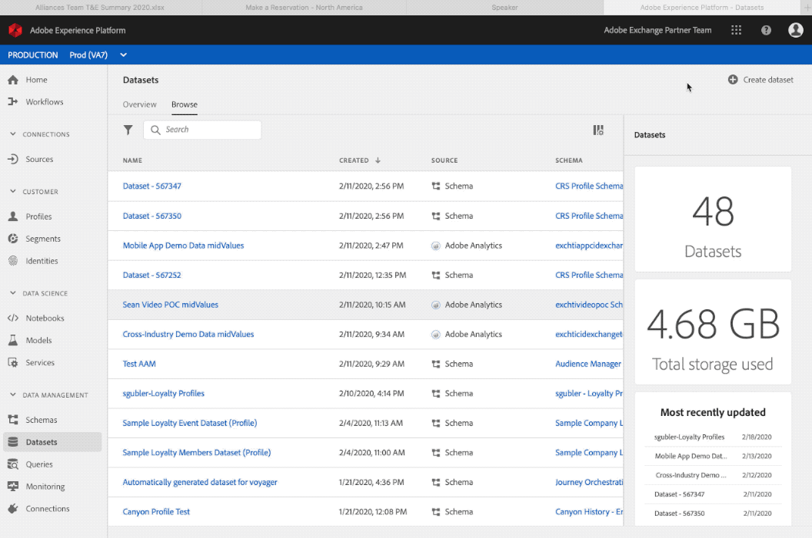

# Create Schemas and Datasets

The [Postman collection](https://github.com/Adobe-Marketing-Cloud/exchange-aep-profile-integration-postman) will be referenced throughout the article using the associated calls by number. More details on installing and using the Postman collection are available on the Github [README](https://github.com/Adobe-Marketing-Cloud/exchange-aep-profile-integration-postman/blob/master/README.md) page. There are also sample datasets of [loyalty](https://github.com/Adobe-Marketing-Cloud/exchange-aep-profile-integration-postman/blob/master/AEP%20loyalty%20events.json) and [profile](https://github.com/Adobe-Marketing-Cloud/exchange-aep-profile-integration-postman/blob/master/AEP%20loyalty%20profiles.json) data.

## Schemas

### What is a schema?

A schema is a set of rules that represent and validate the structure and format of data. At a high level, schemas provide an abstract definition of a real-world object (such as a person) and outline what data should be included in each instance of that object (such as first name, last name, birthday, and so on). Schemas can be created in the UI or using the Experience Platform APIs.

See [this documentation](https://www.adobe.io/apis/experienceplatform/home/xdm/xdmservices.html#!api-specification/markdown/narrative/technical_overview/schema_registry/schema_composition/schema_composition.md) for more details.

### Creating a schema 

You can build an example schema using the UI by following this [tutorial](https://docs.adobe.com/content/help/en/experience-platform/xdm/tutorials/create-schema-ui.html). This example uses the loyalty program profile schema. While the example is a profile schema, event-based schemas can be used using a similar process.

If you'd like to build a schema using the APIs, you must have an existing Adobe I/O integration with Experience Platform permissions enabled. If you don't already have one, check out the following documentation for information on how to [create an I/O integration](https://www.adobe.io/apis/experienceplatform/home/tutorials/alltutorials.html#!api-specification/markdown/narrative/tutorials/authenticate_to_acp_tutorial/authenticate_to_acp_tutorial.md).

Then visit [this link](https://docs.adobe.com/content/help/en/experience-platform/xdm/tutorials/create-schema-api.html) to learn how to build schemas using the API.

To create a schema via Postman, use the calls contained in folders 1: Create Schema, 1a: Create Schema for PROFILE data OR 1b: Create Schema for EVENT data.

## Datasets

### What is a dataset?

All data that is brought into Adobe Experience Platform is contained in datasets. A dataset is a storage and management construct for a collection of data, typically a table, that contains a schema (columns) and fields (rows). Datasets also contain metadata that describes various aspects of the data they store.

Catalog Service is the system of record for data location and lineage within Experience Platform, and is used to create and manage datasets. Catalog tracks the metadata for each dataset, which includes a reference to the Experience Data Model (XDM) schema the dataset conforms to (explained in the next section) and the number of records ingested into that dataset.

Go [here](https://docs.adobe.com/content/help/en/experience-platform/catalog/datasets/overview.html) for a detailed dataset overview. 

### Creating a dataset

Create a dataset via the UI:

1. Click create dataset
2. Create from schema
3. Click finish

Go [here](https://docs.adobe.com/content/help/en/experience-platform/catalog/datasets/user-guide.html) for a dataset user guide.

[Create a dataset using the APIs](https://docs.adobe.com/content/help/en/experience-platform/catalog/datasets/create.html).

To create a dataset via Postman, use folders 2: Create Dataset, 2a: Create dataset for PROFILE data OR 2b: Create dataset for EVENT data.

## Schema and dataset best practices for partners

* Partner data should use a separate profile schema vs creating a mix-in for a customer's existing profile schema and experience schema. 
* Partners should use Adobe classes and mix-ins where possible.
* Partners should upload their data using a separate dataset instead of trying to combine their data into an existing dataset.
* Partners cannot upload their schemas to the global registry for now.